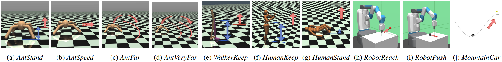
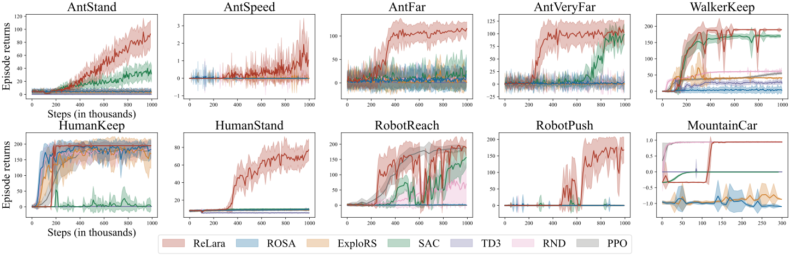

# [ICML 2024] Reward Shaping for Reinforcement Learning with An Assistant Reward Agent

The codes for the proposed **Re**inforcement **L**earning with an **A**ssistant **R**eward **A**gent (ReLara) algorithm.

[[Paper Link](https://icml.cc/virtual/2024/poster/33703)]

## Table of Contents

- [Requirements](#requirements)
- [Run ReLara Algorithm](#run-relara-algorithm)
- [Comparative Evaluation](#comparative-evaluation)

## Requirements

- This code has been tested on:
```
pytorch==2.0.1+cu117
```
- Install all dependent packages:
```
pip3 install -r requirements.txt
```

## Run ReLara Algorithm

Run the following command to train ReLara on the task specified by `<Task ID>`:

```
python run-ReLara.py --env-id <Task ID>
```

All available environments with sparse rewards evaluated in our paper are listed below:



* Mujoco-Sparse:
    - `MyMujoco/Ant-Height-Sparse`: the *AntStand* task.
    - `MyMujoco/Ant-Speed-Sparse`: the *AntSpeed* task.
    - `MyMujoco/Ant-Far-Sparse`: the *AntFar* task.
    - `MyMujoco/Ant-Very-Far-Sparse`: the *AntVeryFar* task.
    - `MyMujoco/Walker2d-Keep-Sparse`: the *WalkerKeep* task.
    - `MyMujoco/Humanoid-Keep-Sparse`: the *HumanKeep* task.
    - `MyMujoco/HumanoidStandup-Sparse`: the *HumanStand* task.
* Robotics-Sparse:
    - `MyFetchRobot/Reach-Jnt-Sparse-v0`: the *RobotReach* task.
    - `MyFetchRobot/Push-Jnt-Sparse-v0`: the *RobotPush* task.
* Classic control:
    - `MountainCarContinuous-v0`: the *MountainCar* task.

All hyper-parameters are set as default values in the code. You can change them by adding arguments to the command line. All available arguments are listed below:

```
--exp-name: the name of the experiment, to record the tensorboard and save the model.

--env-id: the task id
--seed: the random seed.
--cuda: the cuda device, default is 0, the code will automatically choose "cpu" if cuda is not available.
--gamma: the discount factor.

--total-timesteps: the total timesteps to train the agent.
--pa-learning-starts: the burn-in steps of the policy agent.
--ra-learning-starts: the burn-in steps of the reward agent.

--proposed-reward-scale: the scale of the proposed reward, default is 1.
--beta: the weight of the proposed reward, default is 0.2.

--pa-buffer-size: the buffer size of the policy agent.
--pa-rb-optimize-memory: whether to optimize the memory of the policy agent
--pa-batch-size: the batch size of the policy agent
--ra-buffer-size: the buffer size of the reward agent.
--ra-rb-optimize-memory: whether to optimize the memory of the reward agent
--ra-batch-size: the batch size of the reward agent

--pa-actor-lr: the learning rate of the actor of the policy agent
--pa-critic-lr: the learning rate of the critic of the policy agent
--pa-alpha-lr: the learning rate of the alpha of the policy agent
--ra-actor-lr: the learning rate of the actor of the reward agent
--ra-critic-lr: the learning rate of the critic of the reward agent
--ra-alpha-lr: the learning rate of the alpha of the reward agent

--pa-policy-frequency: the policy frequency of the policy agent
--pa-target-frequency: the target frequency of the policy agent
--pa-tau: the tau of the policy agent
--ra-policy-frequency: the policy frequency of the reward agent
--ra-target-frequency: the target frequency of the reward agent
--ra-tau: the tau of the reward agent

--pa-alpha: the alpha of the policy agent
--pa-alpha-autotune: whether to autotune the alpha of the policy agent
--ra-alpha: the alpha of the reward agent
--ra-alpha-autotune: whether to autotune the alpha of the reward agent

--write-frequency: the frequency to write the tensorboard
--save-frequency: the frequency to save the checkpoint
--save-folder: the folder to save the model
```

## Comparative Evaluation

The comparison of ReLara with several baselines, including [ROSA](https://ojs.aaai.org/index.php/AAAI/article/view/26371) (Mguni et al., 2023), [ExploRS](https://proceedings.neurips.cc/paper_files/paper/2022/hash/266c0f191b04cbbbe529016d0edc847e-Abstract-Conference.html) (Devidze et al., 2022) [SAC](https://proceedings.mlr.press/v80/haarnoja18b) (Haarnoja et al., 2018), [TD3](https://proceedings.mlr.press/v80/fujimoto18a.html) (Fujimoto et al., 2018), [RND](https://arxiv.org/abs/1810.12894) (Burda et al., 2018) and [PPO](https://arxiv.org/abs/1707.06347) (Schulman et al., 2017), is shown below:




